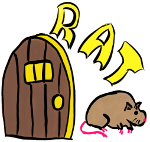

# $\color{goldenrod}{\textbf{Really?\ Another\ Tracker?\ (RAT)}}$

 *Just another map tracker with a core focus of making entrance randomization runs easier to route.*

---

## $\color{goldenrod}{So\ What\ Is\ RAT?}$

RAT is an idea I've had for a while. The problem I have with other trackers is that there's usually
poor support for settings like Entrance Randomization. It almost always falls to the player to keep a mental
map of entrances and exits or be constantly jotting them down on a notepad or text file somewhere.
RAT aims to solve this issue by allowing users to actually lay maps out and draw connections between
entrances and exits. This would allow players to at a glance gain a better grasp of where they are and
how to get to where they want to go. Along with the core focus of Entrance/Exit tracking, RAT also 
provides Item tracking and the ability to hide aspects of the GUI to allow players to focus on what
they want without having a cluttered screen.
___

## $\color{goldenrod}{\textsf{Planned\ Features}}$

- [-] $\color{skyblue}{Zoom,\ pan\ and\ infinte\ Grid\ for\ placing\ maps}$
- [x] $\color{skyblue}{Drag\ to\ place\ and\ move\ maps}$
- [-] $\color{skyblue}{Sliding\ windows\ for\ item\ tracker,\ available\ maps,\ etc}$
- [-] $\color{skyblue}{YAML\ based\ pack\ creation\ and\ loading}$
- [ ] $\color{skyblue}{Entrance/Exit\ Linking}$
- [ ] $\color{skyblue}{Item\ Tracking}$
- [ ] $\color{skyblue}{Custom\ Logic\ Rules}$
___
